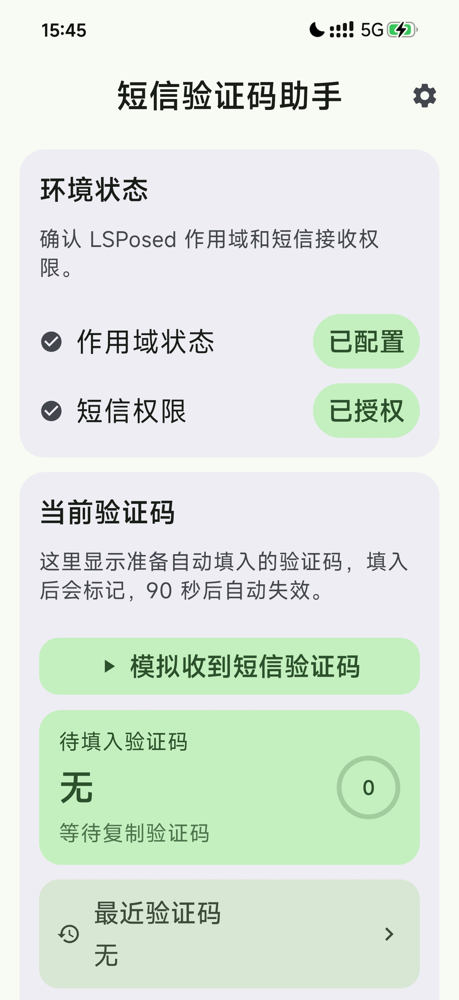

# 短信验证码助手 / SMS OTP Helper

短信验证码助手是一个 LSPosed 模块，用于从短信或短信通知中提取验证码，并通过当前输入法自动填入。验证码会临时写入剪贴板，并在生成 90 秒后清理。

## 正式版说明

- 当前版本：`1.0.0`
- 下载 APK：[sms-otp-helper-v1.0.0.apk](releases/sms-otp-helper-v1.0.0.apk)
- 需要 Android 10+。
- 需要在 LSPosed 中勾选短信 App 和当前输入法 App。
- Android 13+ 需要授予通知权限，收到验证码时会显示“验证码已就绪”提示。
- 安装或升级后建议重启手机，或至少强行停止短信 App 与当前输入法进程。

## 基本流程

1. 短信或通知出现验证码。
2. 模块提取 4-8 位数字或常见字母数字验证码。
3. 验证码进入临时剪贴板，90 秒后失效。
4. 当前输入法检测到临时验证码后自动填入。
5. 填入成功后只标记为已填入，避免重复输入；临时剪贴板仍按生成时间 90 秒后清理。

## 发布包

正式版 APK：

[`releases/sms-otp-helper-v1.0.0.apk`](releases/sms-otp-helper-v1.0.0.apk)

SHA256：

`2F58AED84A41068203F95E80F9A605FCD6F2A4DE84DC9416A3C0FA51E7C77187`
